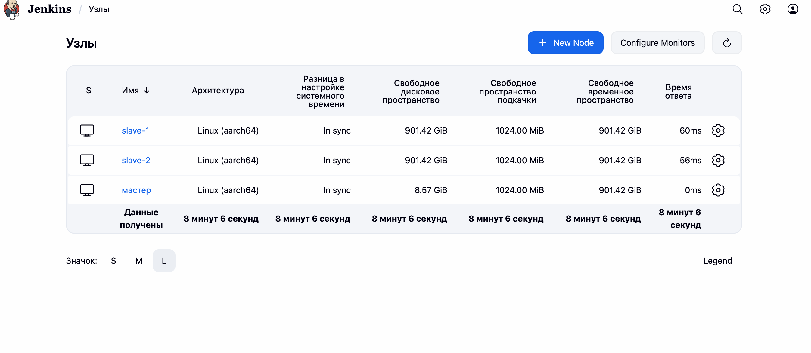
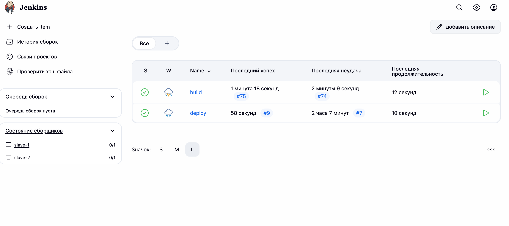
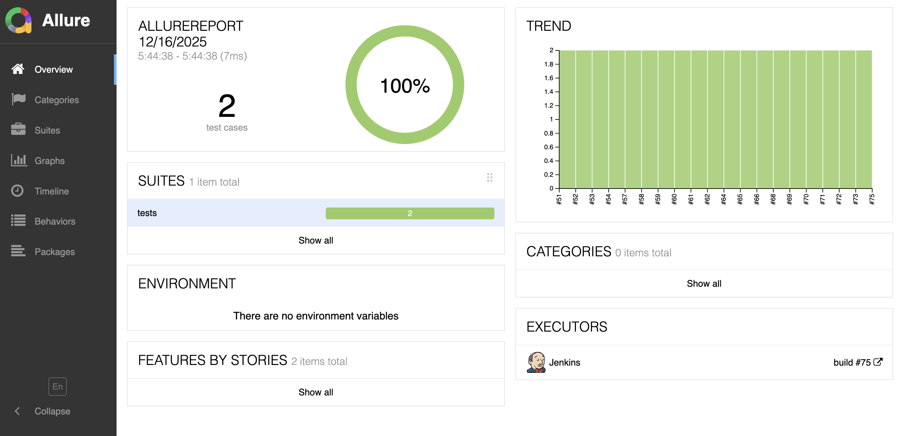
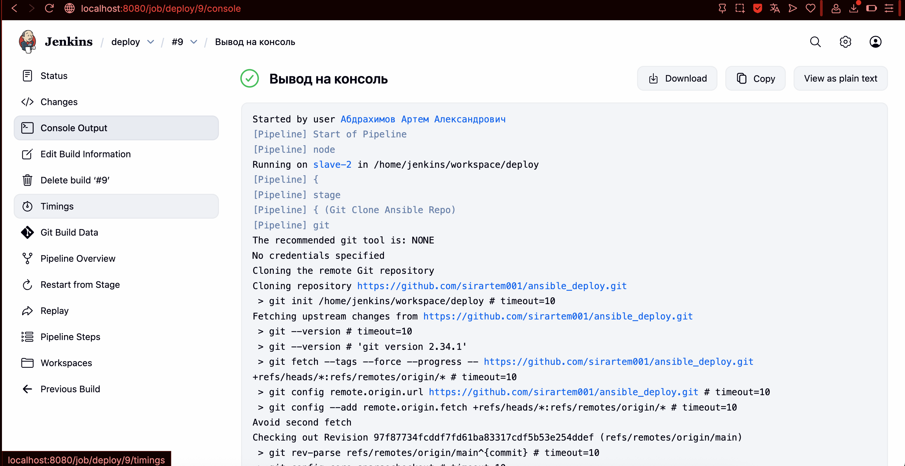

Подсоединил двух агентов к мастер ноде

На первом будем билдиться и тестироваться, на втором продакш. 

Настроил два пайплайна.

Результаты тестирования отображаются в alure

Для статических тестов использовал pylint. С найстройкой сонара не справился....

Логи полностью можно посмотреть в файлах build.log deploy.log

